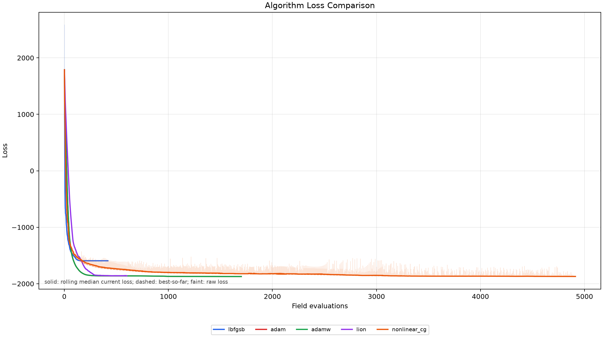
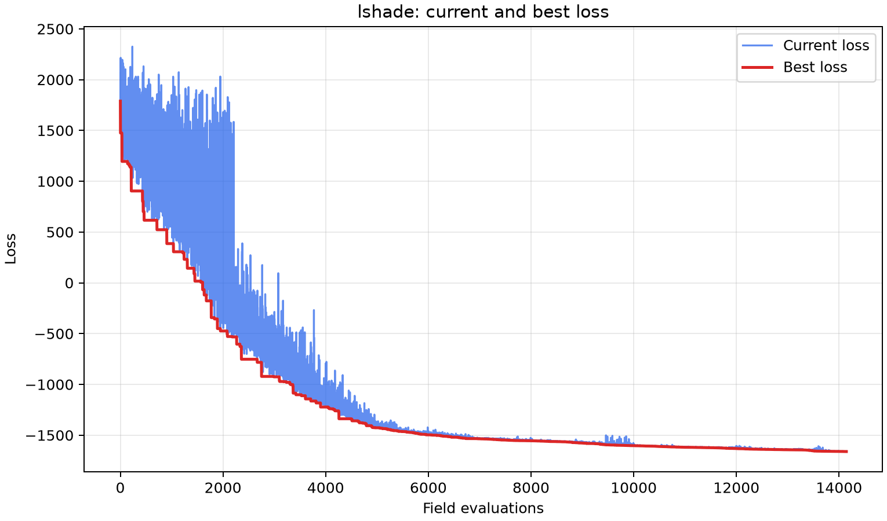
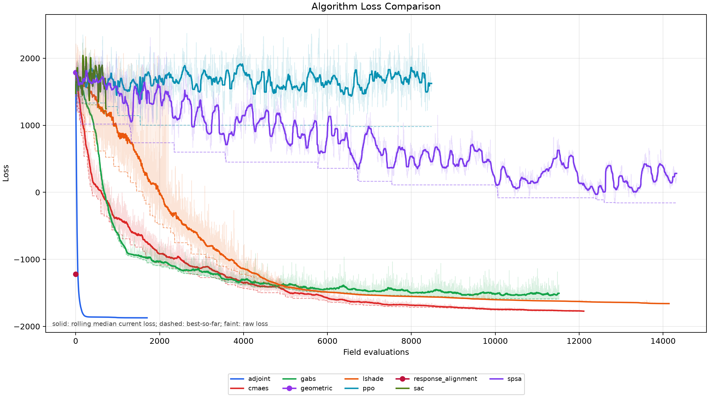

# 解析梯度优化器消融实验

本实验固定物理场景、相位响应基、目标函数、初始相位和解析相位梯度，仅替换相位更新规则。目的不是比较不同信息条件下的算法，而是验证性能优势是否来自解析伴随梯度本身，而非仅来自 L-BFGS-B。

## 统一条件

- 场景：12 x 12 阵列、41 x 41 x 41 网格、远斜向目标点 `[0.09, 0.09, 0.09] m`、`+x` 反射边界。
- 初始相位：传统几何相位。
- 目标：`focal_contrast`。
- 梯度：所有方法均调用相同的响应基 VJP，即解析 `dL/dphi`。
- 比较：每种方法独立运行，单独计时；响应基仅构建一次，其耗时在汇总中单列。
- 停止协议：统一 `60 s` 墙钟窗口和 `15000` 次场评估安全上限。Adam、AdamW、Lion 与非线性共轭梯度每 100 次更新检查 best loss 的相对改善；不足 `1e-5` 时提前停止。L-BFGS-B 使用其标准收敛判据。

## 更新器

| ID | 更新器 | 说明 |
|---|---|---|
| `lbfgsb` | L-BFGS-B | 二阶历史近似。 |
| `adam` | Adam | 自适应一阶更新。 |
| `adamw` | AdamW | 解耦权重衰减；本实验设 `weight_decay: 0`，因为相位是周期变量。 |
| `lion` | Lion | 基于符号动量的现代一阶更新。 |
| `nonlinear_cg` | Polak-Ribiere+ 非线性共轭梯度 | 采用 Armijo 回溯线搜索。 |

## 本次结果

所有方法均使用同一几何初相位，并在统一 `60 s` 墙钟窗口内运行。响应基只构建一次，未计入下表的单方法优化耗时；本轮使用 GPU 常驻响应基及 GPU loss/cotangent/VJP 路径。

| 更新器 | Best loss | 对比度 | 场评估次数 | VJP 次数 | 优化耗时 |
|---|---:|---:|---:|---:|---:|
| L-BFGS-B | -1593.498 | 2.559 | 419 | 419 | 24.84 s |
| Adam | **-1872.539** | **2.814** | 1701 | 1701 | 13.09 s |
| AdamW (`weight_decay=0`) | **-1872.539** | **2.814** | 1701 | 1701 | 13.46 s |
| Lion | -1862.353 | 2.769 | 601 | 601 | **4.37 s** |
| Nonlinear CG | -1871.149 | 2.805 | 4913 | 4913 | 35.52 s |

上表的“优化耗时”是算法触发停止时的总耗时，包含进入高质量区域后的精修与收敛确认；它不适合作为不同最终质量之间的主效率指标。质量匹配结果见下一节。

### 质量匹配效率

以相同 loss 门槛统计首次达到该质量的时间和场评估次数，而非比较各算法各自停止时的时间：

| 更新器 | 达到 `-1593.498` | 达到 `-1800` | 达到 `-1860` |
|---|---:|---:|---:|
| L-BFGS-B | 23.92 s / 289 次 | 未达到 | 未达到 |
| Adam | **0.71 s / 89 次** | **1.26 s / 163 次** | **2.69 s / 350 次** |
| AdamW (`weight_decay=0`) | 0.71 s / 89 次 | 1.32 s / 163 次 | 2.93 s / 350 次 |
| Lion | 1.17 s / 165 次 | 1.80 s / 252 次 | 3.35 s / 457 次 |
| Nonlinear CG | 1.10 s / 148 次 | 6.08 s / 841 次 | 21.14 s / 2957 次 |

因此 Adam 的 `13.09 s` 是达到严格停滞判据的总时间，而不是达到高质量解所需时间。它在 `2.69 s` 已首次达到 `-1860`，之后的时间仅带来从 `-1860` 到 `-1872.539` 的小幅精修与稳定性确认。Adam 和 AdamW 的 `weight_decay=0` 完全一致，二者在本次确定性设置下得到相同最优解；单次墙钟的细微差异来自运行时波动，不能解释为权重衰减收益。

原始质量匹配记录见 [`quality_summary.csv`](results/phase_oblique_reflecting_x_12x12/quality_summary.csv) 和 `quality_summary.json`。

### 更新器 Loss 对比图



## 与 L-SHADE 黑盒基线对比

L-SHADE 不属于上表的“解析梯度更新器消融”：它只访问候选相位对应的标量损失，不调用响应基 VJP 或解析梯度。为说明解析梯度带来的信息优势，下表引用同一 `12 x 12` 物理场景、相同几何初相位与 `focal_contrast` 目标下的公开算法对比结果。

| 方法 | 信息条件 | Best loss | 对比度 | 场评估次数 | VJP 次数 | 优化耗时 | 配置墙钟预算 |
|---|---|---:|---:|---:|---:|---:|---:|
| Adam / AdamW (`weight_decay=0`) | 解析 VJP | **-1872.539** | **2.814** | 1701 | 1701 | 13.09-13.46 s | 60 s |
| L-BFGS-B | 解析 VJP | -1593.498 | 2.559 | 419 | 419 | 24.84 s | 60 s |
| L-SHADE / Differential Evolution | 仅标量损失 | -1660.869 | 2.528 | 14142 | 0 | 60.00 s | 60 s |

L-SHADE 将几何相位初值的 loss 从 `1788.425` 降至 `-1660.869`，说明该任务并非只有梯度法能优化。但 Adam/AdamW 在统一 60 s 协议下以更少场评估达到更低 loss；L-SHADE 在本窗口内未达到 Adam 的最终质量。

两张表均来自当前 GPU 优化版本的重新运行。因仍为单随机种子，结论应以该固定场景的对照结果表述，后续需使用多种子报告均值、标准差与 P95。

### L-SHADE Loss 曲线



### 全算法对比曲线



## 结论

本消融实验表明，系统的优化优势主要来自物理模型提供的解析伴随梯度，而不是仅由某一个特定优化器造成。在统一响应基、目标函数、初始相位和停止协议下，五种更新器均显著降低 loss；其中 Adam/AdamW 在本场景取得最佳结果，best loss 为 `-1872.539`、对比度为 `2.814`。L-SHADE 对照进一步表明，无梯度进化搜索在同等时间窗口内也能收敛到高质量解，但当前仍低于 Adam 类更新器，且使用更多场评估。

L-BFGS-B、非线性共轭梯度和 Lion 同样能稳定收敛，但本轮不及 Adam 类更新。由于 AdamW 设置 `weight_decay: 0`，它不引入额外物理正则，且本次与 Adam 得到相同最优解。后续应在更多目标位置、边界和障碍物场景中重复该实验，并报告多随机种子统计。

## 指标

- `best_loss` 和 `final_loss`
- 目标区域平均振幅 `target_mean`
- 背景最大振幅 `background_max`
- 焦点/旁瓣对比度 `contrast`
- 真实声场评估次数 `field_evaluations`
- 解析 VJP 次数 `vjp_evaluations`
- 每种更新器优化耗时 `optimization_seconds`
- 共享响应基构建/加载耗时 `shared_basis_build_or_load_seconds`
- 达到共同质量门槛的时间与场评估次数 `quality_summary.csv/json`

`loss_dashboard.png` 将所有更新器叠加在同一坐标轴：透明细线为原始 current loss，实线为滚动中位数，虚线为 best-so-far；横轴为真实场评估次数。

## 运行

```powershell
python gradient_ablation/run_ablation.py
```

只运行指定更新器：

```powershell
python gradient_ablation/run_ablation.py --optimizers lbfgsb,adam,nonlinear_cg
```

无窗口批处理：

```powershell
python gradient_ablation/run_ablation.py --no-loss-window
```

从已保存的 `result.npz` 重建质量匹配统计：

```powershell
python gradient_ablation/run_ablation.py --rebuild-quality-summary
```

结果写入：

```text
gradient_ablation/results/phase_oblique_reflecting_x_12x12/
  summary.csv
  summary.json
  quality_summary.csv
  quality_summary.json
  loss_dashboard.png
  <optimizer>/
    config.yaml
    result.npz
    result_loss.png
```

首次运行会构建相位响应基缓存，后续运行自动复用。本目录不提交该缓存文件。
