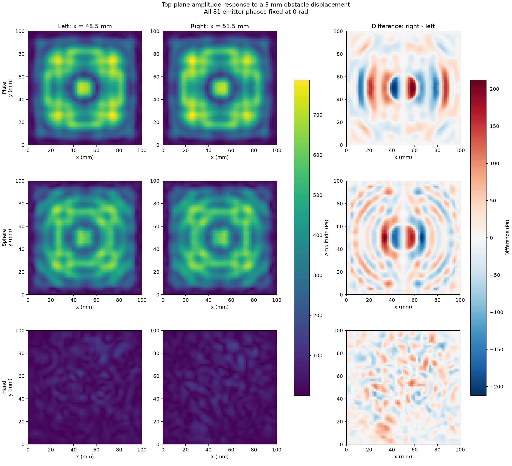
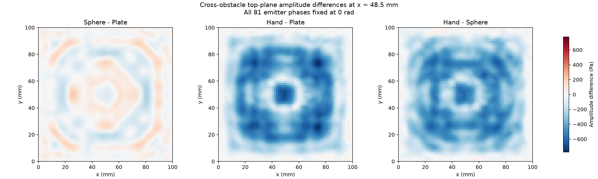
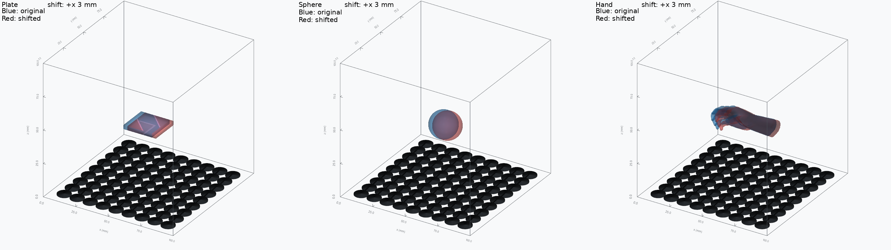
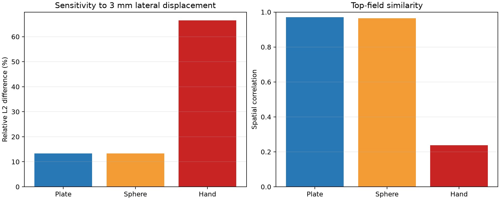
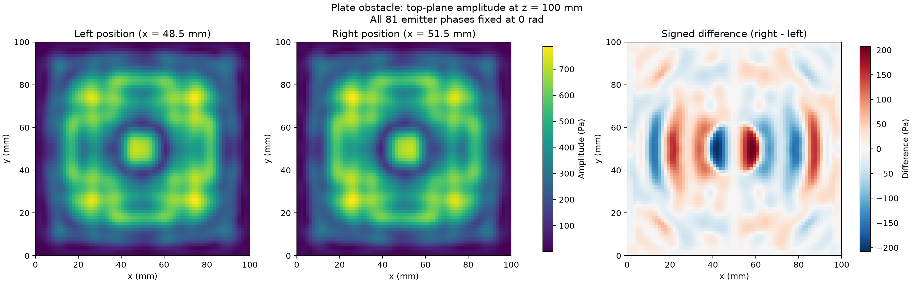
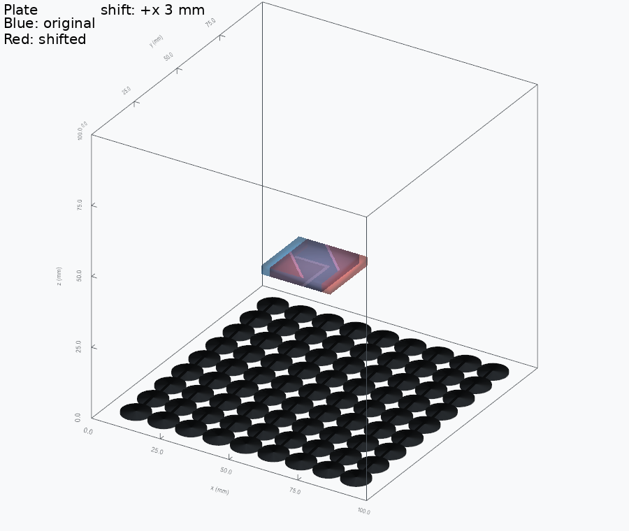
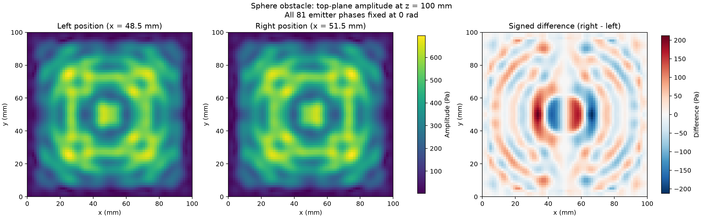
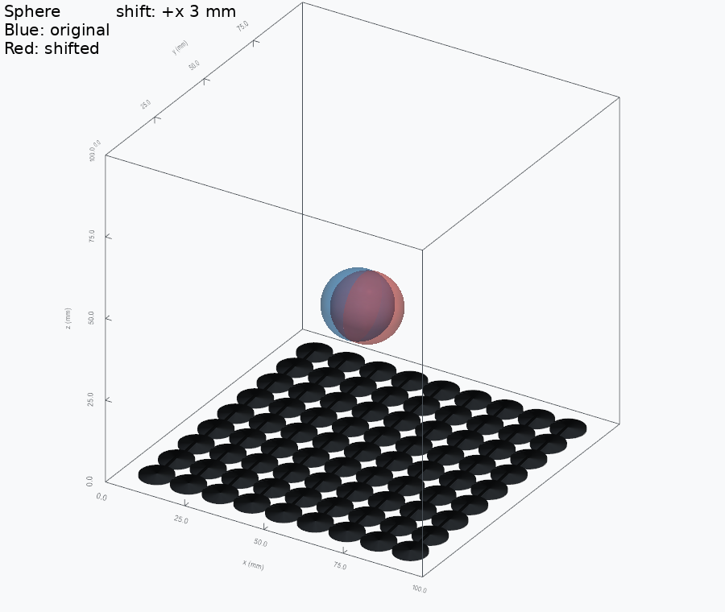
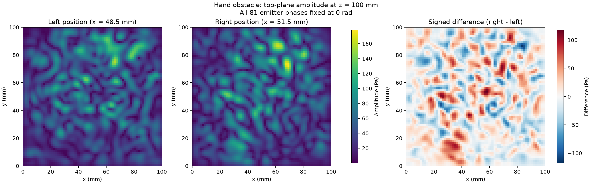
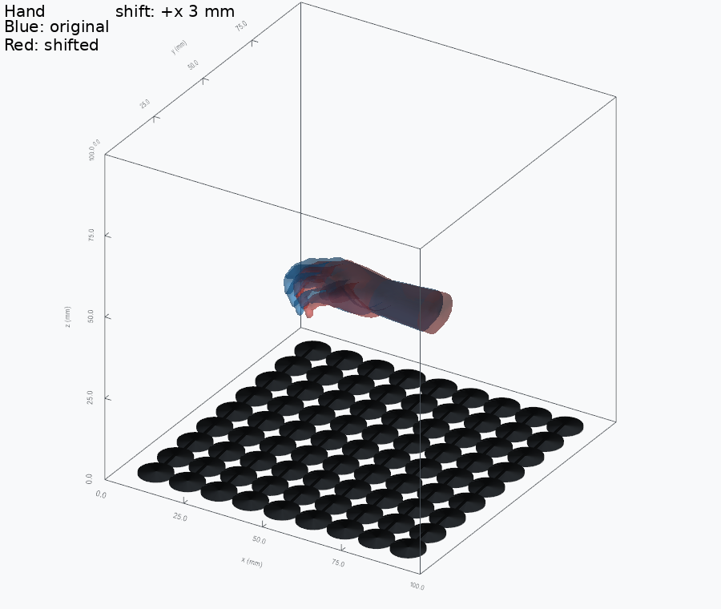

# 障碍物横向轻移实验

本实验用于观察障碍物发生小幅平移时，场景顶部振幅场是否呈现连续、
可用于梯度优化的响应。

## 实验条件

- 81 个换能器均使用硬件标定幅值，所有相位固定为 `0 rad`。
- 不设置目标焦点，不进行相位聚焦。
- 原始障碍物中心：`x = 48.5 mm`。
- 移动后障碍物中心：`x = 51.5 mm`。
- 横向位移：沿 `+x` 方向移动 `3.0 mm`。
- 顶部振幅场：`z = 100 mm` 网格平面上的声压振幅。
- 计算区域：`100 x 100 x 100 mm`，网格：`70^3`，步长：`1.449275 mm`。
- 障碍物材料：密度 `1250 kg/m^3`，声速 `2200 m/s`。

## 数值汇总

| 模型 | 尺寸 (mm) | 左场峰值 (Pa) | 右场峰值 (Pa) | 相对 L2 差异 | 空间相关系数 | 平均绝对差 (Pa) | 最大绝对差 (Pa) |
|---|---:|---:|---:|---:|---:|---:|---:|
| 平板 | 22.0 x 22.0 x 3.0 | 787.05 | 787.05 | 13.2814% | 0.969918 | 34.41 | 207.36 |
| 球体 | 20.0 x 20.0 x 20.0 | 695.30 | 695.30 | 13.3108% | 0.964782 | 35.91 | 211.96 |
| 手部 | 49.8 x 20.0 x 15.4 | 156.83 | 178.12 | 66.5253% | 0.237613 | 25.47 | 117.50 |

## 总览

### 顶部振幅场

每一行对应一种障碍物；三列依次为原始位置、移动后位置和有符号差值
`右场 - 左场`。振幅图使用统一色标，差值图使用以零为中心的对称色标。

### 跨障碍物顶部场差异

这里固定使用原始位置 `x = 48.5 mm` 的顶部振幅场，比较不同障碍物
本身导致的声场变化。理论上的 `3 x 3` 交叉矩阵中，对角线为零，
上下三角互为相反数，因此只保留三个本质差值图：

| 行 - 列 | 平板 | 球体 | 手部 |
|---|---:|---:|---:|
| 平板 | 0 | 20.34% / corr 0.931 | 250.87% / corr 0.267 |
| 球体 | 20.34% / corr 0.931 | 0 | 243.26% / corr 0.306 |
| 手部 | 250.87% / corr 0.267 | 243.26% / corr 0.306 | 0 |

表格中的百分比为对称归一化 L2 差异：
`||行场 - 列场|| / sqrt(||行场|| ||列场||)`。
三张图保留有符号的直接相减结果，标题即为差值方向。

### 三维 SDF 位移叠加

蓝色半透明表面为原始 SDF，红色半透明表面为沿 `+x` 移动 `3.0 mm`
后的 SDF。该图按实验配置对 mesh 做平移、旋转和缩放后绘制
`SDF = 0` 表面；底面绘制真实的 `9 x 9` 同相位换能器阵列，
并显示 `0-100 mm` 三维坐标轴。图中不绘制三维振幅场。

### 灵敏度指标

## 分样例结果

### 平板

### 球体

### 手部

## 结果解释

三种几何发生 `3.0 mm` 位移后，顶部振幅场的相对 L2 差异为
`13.28%` 至 `66.53%`，空间相关系数为 `0.2376` 至 `0.9699`。
这说明顶部场整体结构保持连续，同时对障碍物位置变化具有明显响应。

有符号差值场在空间上呈连续分布，并保留了位移引起的增减方向。
当前结果支持局部连续性，但两个采样位置不足以严格证明可微性。
后续需要使用递减位移步长进行中心差分，并检查差商是否收敛。
